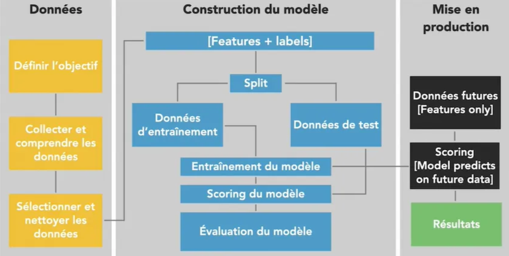

# 🏗️ Développement de Solution Big Data dans Azure

Ce projet illustre le développement et le déploiement d'une application Big Data en temps réel utilisant les technologies 
de la plateforme Azure. Ce travail s'inscrit dans le contexte où les organisations doivent gérer de plus en plus de volumes 
de données et adopter des architectures adaptées à leurs besoins.

## 🌍 Contexte

Nous avons été sollicités par une entreprise de grande distribution ayant plusieurs magasins dans différentes régions.
Cette entreprise rencontre des difficultés à centraliser les données provenant de ses différents magasins et à suivre 
en temps réel les opérations qui s'y effectuent. Elle cherche également à estimer son chiffre d'affaires et à prédire 
les ventes futures de ses clients en temps réel.

### 💡 Solution Proposée

Nous lui proposons une solution basée sur le cloud Azure, permettant de :

- Centraliser les données provenant de tous les magasins.
- Suivre en temps réel les achats et opérations réalisés par magasin.
- Prédire les ventes futures à l'aide de modèles d'apprentissage automatique.

## ⚙️ Technologies Utilisées

- **Azure IoT Hub** : Collecte et gestion des données provenant de capteurs connectés.
- **Azure Stream Analytics** : Traitement des flux de données en temps réel.
- **Azure Machine Learning Service** : Construction et déploiement de modèles d'intelligence artificielle.
- **Azure Blob Storage** : Stockage des données.
- **Power BI** : Visualisation des données pour des analyses approfondies.

## 🏛️ Architecture de la Solution


L'architecture repose sur une collecte de données via IoT Hub, leur traitement avec Stream Analytics, 
le stockage des données dans Azure Blob Storage, et leur analyse avec des modèles de Machine Learning. Les résultats sont ensuite visualisés dans Power BI.

## 🛠️ Développement

1. **🔌 Création de l'IoT Hub** : Mise en place d'un IoT Hub pour recevoir les données des capteurs connectés.
   

2. **⚡ Configuration de Stream Analytics** : 
   - Connexion à l'IoT Hub pour l'ingestion des données.
   - Configuration de requêtes SQL pour traiter les données en temps réel.
   

3. **💾 Stockage des données** : Utilisation de Blob Storage pour conserver les données brutes et traitées.
   

4. **🤖 Intégration du Machine Learning** :
   - Construction de modèles de Machine Learning pour analyser les données. Les modèles utilisés incluent :
     - **Modèle de régression linéaire** : Utilisé pour une première estimation des tendances.
     - **Modèle Random Forest** : Retenu pour ses meilleures performances à l'évaluation.
   - Déploiement du modèle Random Forest via Azure Machine Learning Service.
   

5. **📊 Visualisation des données** : Utilisation de Power BI pour créer des tableaux de bord interactifs.
   

## 🏆 Résultats

- Centralisation des données provenant de tous les magasins.
- Suivi en temps réel des opérations effectuées dans chaque magasin.
- Estimation précise du chiffre d'affaires.
- Prédiction des ventes futures grâce au modèle Random Forest.
- Visualisation claire des indicateurs clés via Power BI.

## 🚀 Instructions pour l'Exécution - Clonez ce dépôt

   ```bash
   git clone https://github.com/votre-utilisateur/developpement-big-data-azure.git
   ```
## 📂 Structure du Dossier

Voici la structure du dossier de travail :

```
├── Azure_Function      # Contient les fonctions Azure pour le traitement des données
├── Data                # Données d'exemple et fichiers utilisés pour les tests
├── Image               # Images utilisées dans le projet (architecture, captures d'écran, etc.)
├── IoTHub_send_data    # Scripts pour envoyer des données vers l'IoT Hub
├── README.md           # Documentation du projet
```

## 🤝 Contributions

Les contributions sont les bienvenues. Veuillez créer une issue ou soumettre une pull request.

## 📄 Licence

Ce projet est sous licence MIT. Voir le fichier [LICENSE](LICENSE) pour plus de détails.
